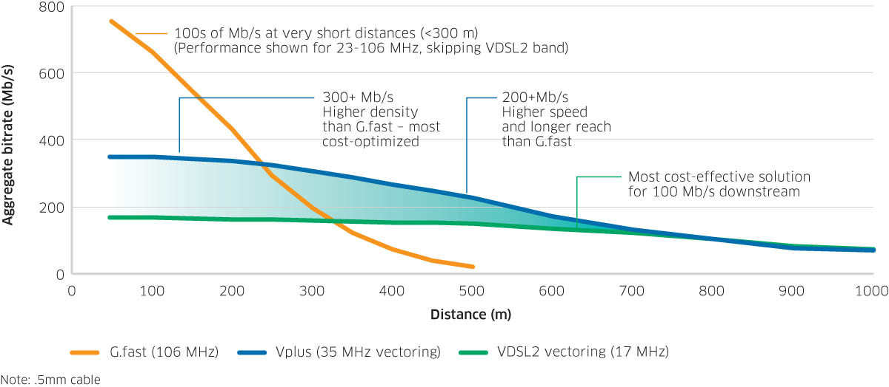

## ISP promised and delivers Gigabit over single-pair copper!

Ice cream and unicorns 🍦& 🦄 , yes I was sceptical of the claims too but **TL;DR**. It's a low latency gigabit fast and reliable service and IMHO it's a technology approach the NBN could have used for apartment complexes from the very beginning 🍿. 

### Who is player 1❓

An enthusiast level rusty ex-ISP network engineer and ~15 years ago I stopped cat herding for an ISP/telco and started herding cats a public cloud company because they said '*we are fanatical about support*', so yes average customer support gets my back up, but anyway the point of mentioning this is those ISP/telco fundamentals of a **[Paper Shop That Never Delivers Papers](https://en.wikipedia.org/wiki/OSI_model),** the **beer truck analogy** of packets and transmission,  **Internet speed = distance/time (frequency )** and that **💩 in = 💩 out** has not been forgotten.

### The previous ISP 👋:

I've been a TPG's FttB (since the pre NBN days) with a vDSL service syncing at 100/40Mbps for $59 a month, it's cheap, it’s not the NBN because the service uses the TPG network the whole way from the MDF room of my apartment complex (~200 units) to the internet so whats not to love? The latency on the line was ~5ms to 7ms but over the past year has been slowly increasing to ~15ms and their customer service & support, it's my opinion that it sucks, it really sucks.


> ```
> I've spent weeks in the past pleading with their support to help me improve the 8bit Minecraft like WebEx calls and random dropouts.
> All rhetorical questions but;
> - Why does it take a customer to point out issues on the core network before you take a look.
> - Why customers always feel like they are copping the blame for the issues, 
> - Why is WebEx traffic routing via the USA from my home in Pyrmont to the WebEx node in Sydney (13445.syd.equinix.com).
> - Why is the latency on my connection getting worse.
> - Why do I get dropouts during busy times, why after an interruption does the line sync at a lower speed.
> - WFH is a thing and why can't the 3rd largest telco in the country just peer directly with AS13445.
> 
> The TPG answer, and I quote "it's your router sir, you need to reboot" & "sometime the internet doesn't give the speeds you want" 🤐🤐🤐. 
> ```
>


Being an enthusiast level rusty ex-ISP network engineer I could work around the WebEx problem using a 4G LTE modem (*thank you employer🙏*) with my pfSense router/firewall I just routed WebEx traffic over 4G and I had crystal clear HD audio and video calls FTW at zero cost (to me) but it annoyed me that I needed to do this.. Anyway there's no point 🙅‍♂️ trying to rationalise those points I'll just take my business elsewhere.


```
🧘🏼 Annnnnnd breath 🧘🏼

Now that's out of the system I'll move on 🧘🏼
```


### **The search for a new provider begins 🚀:**

The phrase ***'It's OK until it’s not OK'*** has never been truer when it comes to the way we now rely upon the Internet because of how and where we work (WFH + 🦠).  Services normally the domian of the corprate like FaceTime, WebEx, Zoom and Netflix (my parents now use daily 🤯) are now being used in the home to stay connected with each other. <u>It's my opinion that we need more from an Internet provider than "typical evening speeds", a reliable low latency connection is of greater value to me than typical evening speeds.</u> 

> and on a side-note my fingers are crossed for more Aussie consumers thinking this way thus creating a market demand and a better internet for all Australians 🇦🇺.

 

#### My building constraints 🏪 ; 

Prior to GigaComm enabling the building the available options are either a NBN retail service provider or TPG Fibre to the Building and from the MDF room to my unit it's an estimated 220 to 250 meters of 4core 26AWG copper cable and a single RJ11 (phone socket). Not great choices for low latency Gigabit Internet so I asked the  NBN for a FttP quote 🙅‍♂️. That's a big fat NOPE and in my opinion that's an unethical amount of money for a building that already has NBN FttB and it's a lot on money for a consumer to pay, it's almost like I was taking the hit for an MDF room upgrade and optic fibre cable for all my neighbours needless to say NBN can jog-on🏃‍♂️. 

At this stage I thought I was stuck with FttB providers and in that case, it's my opinion that Aussie Broadband came out tops in my research and recommendations from friends/colleagues and if I had to choose FttB i'd happliy do so.

##### So whats this Internet speed = distance/time and the beer truck analogy (optional read)?

```
Oh maybe now is the time to explain my perspective on internet speed = distance/time. I promise I'll try be succinct with this using the beer truck analogy, for this example the beer truck is...
  - limited to 100kph,
  - can carry 33,600 bottles of amber nectar,
  - it's 150km between you and the brewery aka about 90min away.

It's just an analogy but a brewery produces the amber nectar in great volumes and theres pubs & bottle shops that a distribute it for consumption in smaller amounts 'please drink responsibly'.

Thus if you could imagine the journey a single 6-pack has taken to on its way to you it involves packing four 6-packs into a slab, then packing 70 slabs onto a pallets and you can fit about 20 pallets on my beer truck. 
All these pallets are loaded onto the beer truck at the brewery and driven to pubs & bottle shops because it would be queues arounf the block if you all headed to the brewery to pickup your 6-packs. 
So to be efficient due to the beer truck operating costs they want to mutually agree a delivery frequency and time slots between the brewery, pubs & bottle shops so the cost of delivering 33,600 bottles of amber nectar is bottles is efficient and costs less per bottle delivered.

As we know frequency is generally defined as the number of cycles which occur in a given interval of **time**, lots of delivery cycles (more beer trucks) could deliver more amber nectar per 90min window of time but your costs will increase due to needing more beer trucks and the brewery is still 150km away. 
Building another brewery closer to me would reduce the **distance** but building a brewery isn't cheap so generally we all agree to share the beer truck and wait **latency**.  
```

The network & tech enthusiast in me obviously upgraded the iPhone when Telstra 5G was launched and thus my mobile internet is 4x faster than my fixed-line internet 🤷‍♂️ and latency is about par on but on both latency is variable. I've also seen via technology news sites the auctions of the mmWave (pronounced as millimetre wave) 5G spectrum has completed, well network providers have paid all that money so someone must be selling a short-range (distance), high-frequency (time) network technology that delivers higher speeds.

### Early GigaComm Scepticism 🤔:

Researching who and whats available I discovered what looks like a smaller but experienced & growing company who are combining mmWave and optical fibre technology to build "a network built for the Gigabit Age".  

- 'A new non-NBN network for the Gigabit age'
- '10x Faster than the Australian download average'
- '24/7 Consistent speeds you can rely on'

The reason FttB is limited to 100/40Mbps (in my building) is because the frequency used by vDSL profile 17a is 17 MHz and the distance to the brewery sorry the DSLAM equipment in the MDF room to my unit an estimated 220 to 250 meters when the max is considered to be 300 meters and in some apartment complexes that could be the full 300 meters. To deliver a 1000/100Mbps service with low latency service needs more MHz of frequency (**time**) using a common method called vectoring (the V in vDSL) and the length of line between me and the to the GigaComm equipment needs to be a much shorter **distance**.



GigaComm even said I could run my NBN / current internet provider side-by-side AND they use the current copper-pair from the basement to my unit! I gave them a call and they described the technology as (think I heard them correctly) **“*<u>a bit of secret source technology</u>*” and that all seemed too good to be true!**

I sent GigaComm [a follow up email](https://github.com/alexanderswift/public-gigacom/blob/main/emails_to_gigacomm.pdf) to seek further clarification basically with a a few more questions if they didn't (an they did not mind, professional and speedy reply) and stating from what GigaComm are saying it looks like they found a way to get the $ per consumer down with a mix of vectoring and fibre in the building. I also asked GigaComm to confirm their ASN so I could research their network and peering to avoid a repeat of the WebEx issues (20+ hours a week on WebEx you need it to work flawlessly).


### Peering 🤝:

GigaComm are AS139049 and there's a number of ways to find out who they peer with and good news for me the look to learn the route to WebEx from Vocus and good news for everyone else for company of their size they are well connected via both Equinix peering LANs ASN's giving them access to all the Equinix buildings in the region and they are aso connected on the IX Australia NSW & VIC carrier-neutral internet exchanges shortening the distance and time to hundreds of ISP's, MSP's, Amazon & Google clouds and CDN's like Akamai and Cloudflare etc.  

```
Useful sites to work this out;
- GIGACOMM-AU https://bgp.he.net/AS139049#_asinfo  
- WebEx https://bgp.he.net/AS13445
- Akamai https://bgp.he.net/AS20940#_asinfo
- Cloudflare https://bgp.he.net/AS13335
- Vocus https://bgp.he.net/AS4826#_peers
- Another option is https://www.peeringdb.com/
- AS139049 traffic on the IX https://metrics.ix.asn.au/d/fY3FT5Mnk/ix-peer?orgId=2&var-Customer=746&var-polling_interval=1m&var-Device=All&var-ASN=AS139049&var-ASNRAW=139049
```

Slight side-topic, I use Apple devices with iCloud Private Relay (iCloud subscription required) and the public IP addresses at the time of writing this I've observed have been 2606:54c0:820:b0::1a:7f, 104.28.125.4 (Cloudflare) and 172.225.60.23 (Akamai) and these are two very  well connected networks so I get the best of a global AS and the access speed of GigaComm. 


### The install and what i've tested so far 🔎:


Install pics and whats this additional box❓

testing side by side 🧪and Adtron


##### Consider whats required to get to Gigabit speeds 🧐.

##### Testing my 

```
My own speed testing comparing the old and the new.
From TPG
Host: speedtest.net (selected GigaComm Pty Ltd Host a server)
0) https://www.speedtest.net/result/12509282802
1) https://www.speedtest.net/result/12505837863
2) https://www.speedtest.net/result/12505887301
3) https://www.speedtest.net/result/12505889645
4) https://www.speedtest.net/result/12505892027
5) https://www.speedtest.net/result/12505894579

Host: tpg.speedtestcustom.com
0) http://tpg.speedtestcustom.com/result/fe5e6de0-6452-11ec-b50d-5754f75e3cf4
1) http://tpg.speedtestcustom.com/result/1a41b560-63bf-11ec-8bed-9336fa9df5d4
2) http://tpg.speedtestcustom.com/result/293d6490-63c1-11ec-8bed-9336fa9df5d4
3) http://tpg.speedtestcustom.com/result/489253f0-63c1-11ec-8bed-9336fa9df5d4
4) http://tpg.speedtestcustom.com/result/63e08820-63c1-11ec-8bed-9336fa9df5d4
5) http://tpg.speedtestcustom.com/result/7caf8b80-63c1-11ec-8bed-9336fa9df5d4
```
